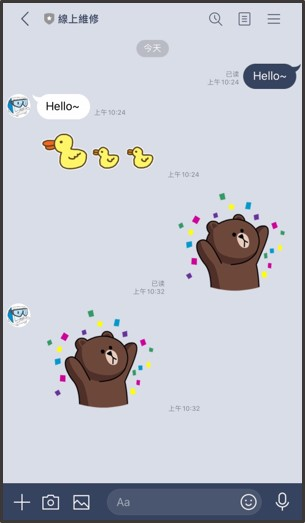
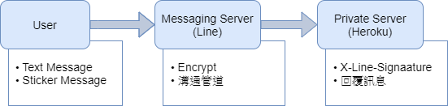
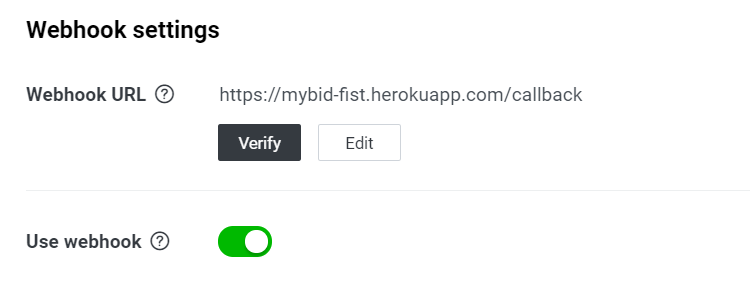
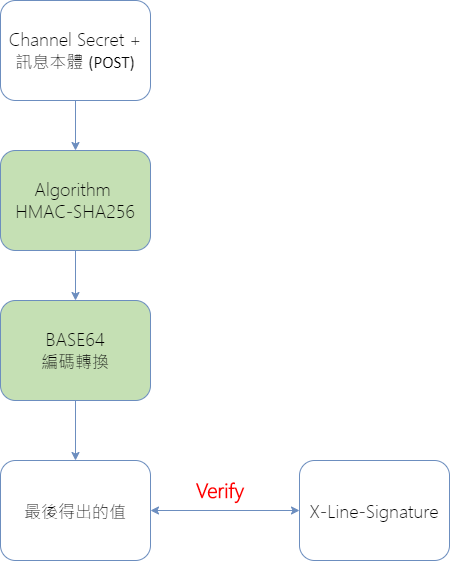

# Eexercise 01: Line Bot

*Line Bot 聊天機器人*

> 搭建 Line聊天機器人  
> 一個提供自動回覆訊息功能的聊天室平台

# Outline
**Demo-Echo Bot  ** --- Functions

**1. Experiment  **
  1.1- Line Bot  
  &emsp;　1.1.1- Introduction  
  &emsp;　1.1.2- Knowledges  
  1.2. Explanation-Code  
  &emsp;　1.2.1- Condition  
  &emsp;　1.2.2- Verification  

**2. Related Work  **
  2.1. Heroku  
  &emsp;　2.1.1- File structure  
  &emsp;　2.1.2- Deploy  
 

~ ~ ~ ~ ~ :blush:

先簡單展示自動回覆功能畫面，再詳細說明使用的過程。

* 報告內容分為兩部分： 
  Part 1- **實驗部分**：
  分別介紹 ，Line Bot的系統之間運作的關係架構、相關知識點；還有聊天機器人對訊息接收和回應的處理方式、訊息加解密方式。

  Part 2- **相關工作部分**： 會介紹當專案寫好後，佈屬到 雲端伺服器平台Heroku，上線運行。 

------
#  Demo-Echo Bot 
* Functions  
  自動回覆：
  1. 收到的文字訊息 + 指定貼圖
  2. 收到貼圖訊息

* 這是簡單的聊天功能展現，有兩種回覆功能：
  1. 輸入文字訊息，就回覆相同的文字訊息，加上指定貼圖。
  2. 輸入貼圖，就回覆相同的貼圖內容。
 

-----
#  1. Experiment 
* 第一部分的實驗：
  1. 使用 line-bot-sdk程式庫，搭建 LINE聊天機器人。
  2. 訊息觸發事件，遇到文字或貼圖訊息時，分別會產生哪些回覆。

## 1.1- Line Bot
* 1.1.1- Introduction: Line  
  * Introduction: Line Bot  
  * How to create the channel?  
* 1.1.2- Knowledges  
  * 使用 line-bot-sdk程式庫開發聊天機器人 
 

### 1.1.1- Introduction: Line
#### Introduction: Line Bot

* 聊天機器人：Line bot
  提供 Messaging API (訊息應用程式介面)，允許外部程式(公司企業)與 Line對接，取代專屬APP。
 

* Line，也就是作為與用戶(消費者)和公司之間的溝通管道，取代(許多應用程式) 專屬APP，省去APP的開發成本。
* 舉例：微信的小程序
 

* 整個 Line Bot的系統，有三部分：
  1. **User(使用者)**：輸入訊息
  2. **Line Server(官方)**： 將訊息加密，POST給個人伺服器的聊天機器人。
  3. **個人伺服器(Heroku)**：金鑰驗證，判斷來源是否為LINE訊息，並進行相對應 訊息觸發事件”的內容回覆。
 

#### How to create the channel?
* Create Channel
  1. Channel secret (頻道密鑰)
  2. Channel access token (頻道存取代碼) 

五個步驟~

* 創建頻道，得到兩項資料：
  1. 頻道密鑰，因為訊息傳輸會加密，用來判斷訊息來源的。
  2. 頻道存取代碼，用來當接口對接外部應用程式，傳輸訊息的。
 

### 1.1.2- Knowledges
> 使用 line-bot-sdk程式庫開發聊天機器人

* 一個基本的 LINE bot程式，包含 4元素：
  1. **LinebotAPI**：  回應 & 發送訊息 
  2. **WebhookHandler**： 解讀 & 包裝訊息 
  3. **“/callback”路由**：  接收 LINE伺服器傳入訊息的
  4. **裝飾器 (decorator)**：  捕捉 LINE訊息事件
 

## 1.2. Explanation-Code
### 1.2.1- Condition

* Library:
  1. **Flask**: 輕量級的網站框架
  2. **Line-bot-sdk**: Line官方的聊天機器人函式庫
 

* Declaring two objects:
  1. **LineBotApi**: Access Token (long-lived)
  2. **WebhookHandler**: Secret
  
  LineBotApi ，頻道存取代碼(長期有效的; 永久的)，對相關的訊息進行**操作**，Ex:  回應&發送訊息  
  WebhookHandler，頻道密鑰，對相關的訊息進行**處理**，Ex: 解讀&包裝訊息內容
 

* Line Setting - **Webhook**:  
  輸入 Python 程式的 callback() 路由網址
  
  用來連結聊天機器人和 LINE伺服器的連結。
  接收 通訊協定POST方法請求的訊息
  WebhookHandler之 (handle物件)的 handle()方法，判斷請求來源是否是源自LINE 訊息伺服器。
 

* 路由程式:
  1. 處理 ”/callback”請求
  2. 確認請求來源是否是源自LINE 訊息伺服器
  * **裝飾器(decorator)** 定義： 捕捉 LINE訊息事件
 

### 1.2.2- Verification
* **X-Line-Signaature (數位簽章資料)**
  * 驗證過程
  * X-Line-Signaature 欄位，驗證來源。

  
 

* 訊息：回應相同內容
  1. Text Message
  2. Sticker Message
    * 貼圖包編號 (package id)
    * 貼圖編號 (sticker id)
 

------
#  2. Related Work 
* 第二部分的實驗：
  Heroku
  1. File structure
  2. Deploy

## 2.1. Heroku
* Heroku -- the Cloud Platform
  將寫好的程式上傳，**完成專案佈署**。
 

### 2.1.1- File structure
  
 

### 2.1.2- Deploy
* 佈署專案
* 將寫好的應用程式佈署至Heroku
 

* Execute commands
  * 登入Heroku
    > $ heroku login

  * 初始化專案
    > $ git init  
    > $ heroku git:remote -a bot_sticker.py

  * 更新專案
    > $ git add .  
    > $ git commit -m "bot_sticker.py"  
    > $ git push heroku master

 

-----
# Notes
* 進一步對各文檔做說明

* **Procfile**
    * 定義專案程式類型和主程式名稱，讓Heroku知道如何配置與啟動此專案。
    * 告訴Heroku如何執行程式
    * 檔名P 規定大寫
    * Flask網站程式，屬於web類型，執行環境使用gunicorn
 

* **requirements.txt**
  * 列舉執行專案程式所需的程式庫套件和版本
  * 描述程式運作時所需要的套件
  * 儲存於專案原始碼的根目錄
  * 佈署Python前的準備工作：產生requirements.txt檔
    * 安裝佈署專案程式前，需先列舉所需的程式庫名稱和版本。
    * 利用pip工具程式的freeze命令，自動產生專案的相依套件版本清單。
 

* **runtime.txt**
  * 指定專案的執行環境，Ex: Python 3.7.2
  * 描述使用的python環境
 

-----
# Reference
[[1] 超圖解 Python 程式設計入門_Ch13-打造LINE聊天機器人_趙英傑](https://www.books.com.tw/products/0010826519)

